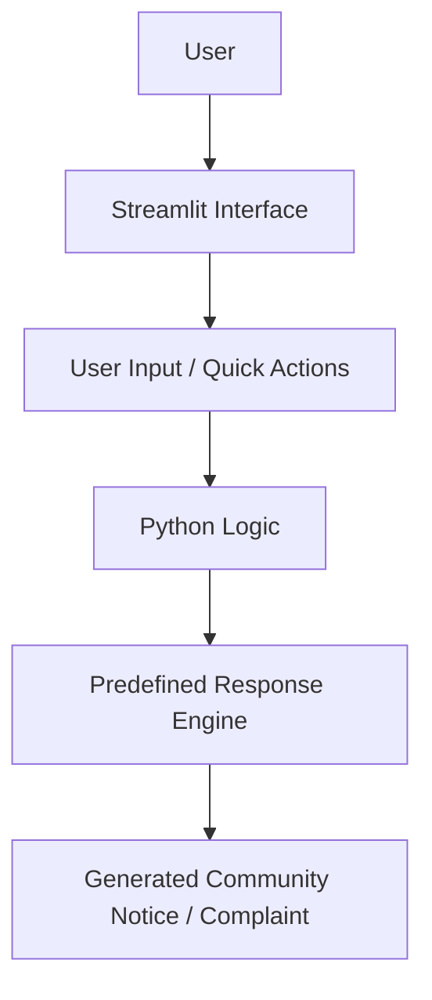

# 🏡 CommuniLink AI


CommuniLink AI is a Streamlit-based **AI-assisted prototype** created during the **Gen AI Academy APAC Edition Hackathon**.

The objective was to design a practical AI-powered solution for a real-world problem. My team chose to build a community assistant that helps residents draft notices, organize neighborhood activities, and report civic issues.

## Features
- 📝 Draft neighborhood notices
- 🛠️ Generate complaint letters for civic issues
- 💬 Simple and user-friendly interface
- ⚡ Built with Streamlit
- 🤖 AI-assisted development

## 🏗️ Project Architecture



## 🎥 Project Demo
Watch a short demonstration of CommuniLink AI in action.

<video src="https://github.com/user-attachments/assets/72ec8df0-a9dc-4bf4-b094-94f5aae46787" width="100%" controls></video>

## 🚀 How to Run Locally (Instructions)

To run this project on your own machine, follow these steps:

1. **Clone the repository:**
   ```bash
   git clone [https://github.com/promeetsrivastava1-cloud/CommuniLink-AI.git](https://github.com/promeetsrivastava1-cloud/CommuniLink-AI.git)
   ```
2. **Install the required dependencies:**
   ```bash
   pip install -r requirements.txt
   ```
3. **Launch the application:**
   ```bash
   streamlit run app.py
   ```

## Project Purpose
This project demonstrates how Generative AI concepts can be applied to solve everyday community problems through an interactive prototype.

## Development Approach
This project was developed as part of my learning journey during the Gen AI Academy APAC Edition Hackathon.

Since I am currently learning Python and Streamlit, I used **Google Gemini as a coding assistant** to help me understand concepts and implement parts of the application.

I was responsible for identifying the problem, defining the features, integrating the components, testing the application, and preparing the final prototype.

## Future Improvements
- Integrate the live Gemini API
- Multi-language support
- Voice input
- Complaint tracking
- PDF notice generation
